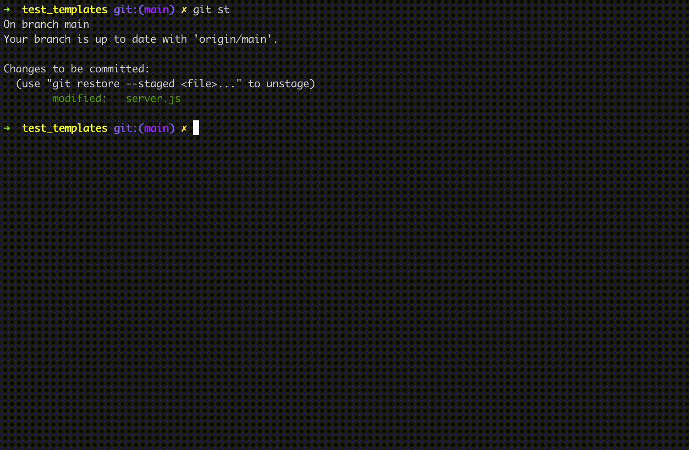

# SECOM configuration 

Configuring SECOM in your repository is very simple! 🤩

```bash
cd repository-path/
cd .git/
mkdir templates/
wget https://github.com/TQRG/secom/template/secom
```

Setting an alias in your github configuration `~/.gitconfig` for security commits is helpful to distinguish security commits than other types of commits. Add the following to your `~/.gitconfig` file:

```bash
[alias]
    secommit = commit -t .git/templates/secom
```

Now, every time you want to commit your security patch just run `git secommit`, fill the template different sections and `git push`. 💥

